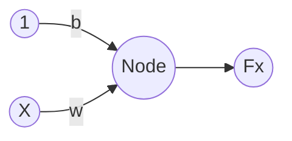

# Linear Regression

## I. Ordinary Least Squares

$$
X=\left[\begin{array}{cc}1 & x^{(1)}\\1 & x^{(2)}\\...\\1 & x^{(n)}
\end{array}\right],
w=\left[\begin{array}{cc}w_0\\w_1\\\end{array}\right],
y=Xw=\left[\begin{array}{cc}y_1\\y_2\\...\\y_n\end{array}\right]
$$

$$
L = \frac{1}{2N}\sum_{i=1}^n (y^{(i)} - \hat{y^{(i)}})^2
$$

$$
\text{Minimize } L \iff \frac{\partial L}{\partial w} = 0
$$

$$
w = (X^TX)^{-1}X^Ty
$$

## II. Gradient Descent

### 1. Loss function Mean Squared Error - MSE

$$
L(w) = \frac{1}{2m} \sum_{i=1}^{m} (\hat{y}^{(i)} - y^{(i)})^2
$$

### 2. Gradient Descent update

$$
w \leftarrow w - \alpha \frac{\partial L(w)}{\partial w}
$$

$$
\frac{\partial L(w)}{\partial w} = \frac{1}{m} X^T (Xw - y)
$$

$$
w \leftarrow w - \alpha \cdot \frac{1}{m} X^T (Xw - y)
$$

## III. Simple Neural Network for Linear Regression

